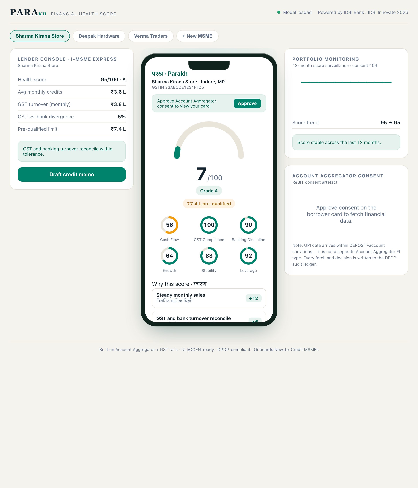

# PARAKH — MSME Financial-Health Scoring

[](https://github.com/IHRM-AI/PARAKH/actions/workflows/ci.yml)

**IDBI Innovate 2026 · Track 3 (Financial Health Score)**

PARAKH (परख, "appraisal of true worth") scores a New-to-Credit MSME from alternate data on Account Aggregator and GST rails, producing a **0-100 health card the business owns** — a composite score, six dimension sub-scores, vernacular reason codes, and a pre-qualified limit — plus a sanction-ready view for the lender.

> Companion to TRINETRA (Track 4) as an MSME credit lifecycle suite: originate with the health card, monitor with the early-warning engine on a shared alternate-data stack.

## Demo



**Live:** http://ihrm-idbi-innovate-1525602521.us-east-1.elb.amazonaws.com/parakh/

## What it does
1. **Consents** — the borrower approves an Account Aggregator artefact (ReBIT purpose 103 to originate, 104 to monitor).
2. **Scores** — a calibrated model turns GST, bank and EPFO signals into a 0-100 score, six dimensions and a pre-qualified limit.
3. **Explains** — every score carries plain-language reason codes in Hindi and English.

## Architecture
| Layer | Technique |
|---|---|
| Synthetic persona engine | Economically coherent MSME population with per-source stress shocks |
| Feature layer | Turnover growth and volatility, filing punctuality, GST-vs-bank gap, cash buffer, bounces, headcount trend |
| Score model | LightGBM with isotonic calibration to a 0-100 scale |
| Dimensions | Interpretable sub-scores across six health dimensions |
| Reason codes | SHAP mapped to vernacular (Hindi and English) phrases |
| Consent | ReBIT-style consent artefacts (purpose 103 and 104) |
| GenAI (optional) | OpenAI-compatible client for a self-hosted Gemma model (vLLM) and OCR service; used when configured, deterministic fallback otherwise |
| Serving | FastAPI |

## Why a synthetic population
No public dataset joins GST, bank and EPFO records for the same firm, so the demo corpus is a disclosed synthetic engine. Absolute AUC on synthetic labels partly measures the generator, so the headline result is the **source-ablation ladder**, which shows each consented source adding genuine signal. Every model retrains on the bank's own book in the sandbox.

## Current result
Source-ablation on the synthetic population (out-of-sample AUC, computed by `src/parakh/eval/ablation.py`):

| Consented sources | AUC |
|---|---|
| GST only | 0.73 |
| + AA bank statements | 0.78 |
| + EPFO | 0.80 |

## Quickstart
```bash
pip install -e ".[dev]"
cp .env.example .env
make train      # generate population, run the ablation ladder, train and save the model
make test
make serve      # FastAPI on :8092
```

Interactive API docs are at http://localhost:8092/docs.

## Run the app (frontend)
```bash
cd frontend
npm install
npm run dev     # Vite dev server, proxies /api to the backend on :8092
```
The frontend expects the backend running on port 8092 (start it with `make serve`).

## Project layout
```
src/parakh/
  synth/persona.py      synthetic MSME population
  scoring/              model, dimensions, card assembly
  interpret/            SHAP to vernacular reason codes
  consent/artefact.py   ReBIT consent artefacts (purpose 103 / 104)
  eval/                 source-ablation and metrics
  api/app.py            health, consent and scoring endpoints
```

## GenAI and OCR (optional)
The lender memo and coaching flows use an OpenAI-compatible client (`src/parakh/genai/`) pointed at a self-hosted Gemma model on vLLM, and document onboarding uses a self-hosted OCR service. Both are opt-in: set `VLLM_URL` and `OCR_SERVICE_URL` in `.env` to enable them. When unset, the memo endpoint returns a deterministic template and document onboarding is disabled, so the app runs end to end without either service.

## Roadmap
Not implemented in this prototype; called out for honesty:
- Live Account Aggregator, GST and EPFO API integration — adapters are schema-exact but sources are synthetic here.
- Fitted temporal / early-warning model — the monitoring trajectory is a deterministic reconstruction for the demo, not a trained forecaster. The production early-warning engine lives in the companion TRINETRA track.
- Production drift and champion-challenger monitoring (PSI and shadow scoring).

## Compliance
Consent-native, DPDP-aligned, optional on-prem LLM. Adapters for Account Aggregator, GST, EPFO and ULI/OCEN are schema-exact so production rails swap in as configuration. External rails in the prototype are labelled as mocks or synthetic.

## Team
**Team IHRM** — Ishan Mishra (lead), Adarsh Trivedi, Abdullah Sheikh.
